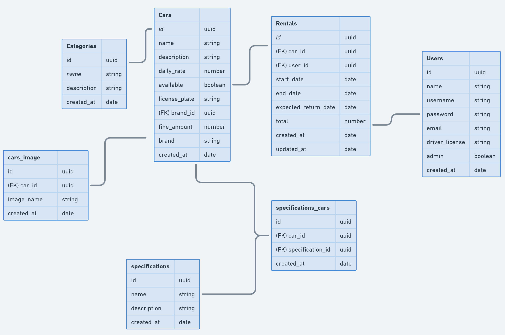

 
 

# RentalX
API para uma plataforma de aluguel de carros 
  

**Modelo de negócio**  
Login, cadastro de veículos, categorias, especificações, upload de arquivo (documentos e imagens), usuários, registros de aluguéis etc.

**Status**  
Em desenvolvimento 
 
 

**Tecnologias** 
- TypeScript
- Node (express)
- Postgres
- TypeORM
- Docker
