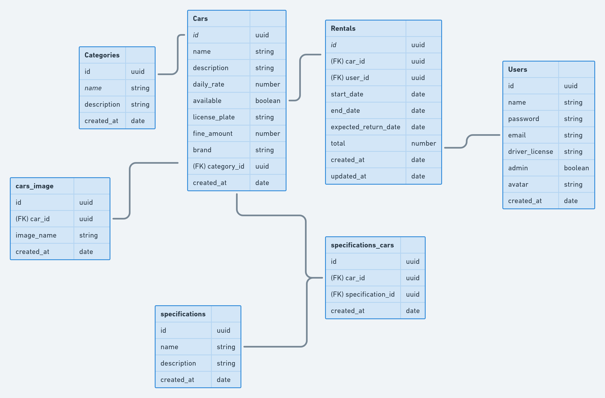

 
 

# RentalX
API para uma plataforma de aluguel de carros 
  

**Modelo de negócio**  
Login, cadastro de veículos, categorias, especificações, upload de arquivo (documentos e imagens), usuários, registros de aluguéis etc.

**Status**  
Em desenvolvimento 
 
 

**Tecnologias** 
- TypeScript
- Node (express)
- Postgres
- TypeORM
- Docker
- Jest e Supertest (testes automatizados) 

**----------------------------------------Especificações----------------------------------------** 
# Cadastro de Veículos
**RF** 
- Deve ser possível cadastrar um novo veículo
 

**RN** 
- Não deve ser possível cadastrar um veículo com uma placa já existente;
- O veículo deve ser cadastrado, por padrão, com disponibilidade para aluguel; 
- O usuário responsável pelo cadastro deve ser um usuário-administrador*
 

# Listagem de Veículos
**RF** 
- Deve ser possível listar todos os veículos disponíveis;
- Deve ser possível listar todos os veículos disponíveis pelo nome da categoria;
- Deve ser possível listar todos os veículos disponíveis pelo nome da marca;
- Deve ser possível listar todos os veículos disponíveis pelo nome do veículo;
 

**RN**
- Para listar os veículos disponíveis, o usuário não precisa estar logado no sistema
 

# Cadastro de Especificação de Veículos
**RF** 
- Deve ser posssível cadastrar uma especificação para um veículo;
- Deve ser possível listar todas as especificações; 
- Deve ser possível listar todos os carros
 

**RN** 
- Não deve ser possível cadastrar uma especificação para um veículo não cadastrado;
- Não deve ser possível cadastrar uma especificação que já existe para o mesmo veículo;
- O usuário responsável pelo cadastro deve ser um usuário-administrador
 

# Cadastro de Imagens de Veículos 
**RF** 
- Deve ser possível cadastrar a imagem do veículo;
- Deve ser possível listar todos os veículos
 

**RNF** 
- Utilizar a biblioteca Multer para realizar o upload dos arquivos
 

**RN** 
- O usuário deve poder cadastrar mais de uma imagem para o mesmo veículo;
- O usuário responsável pelo cadastro deve ser um usuário-administrador
 

# Aluguel de Veículos
**RF** 
- Deve ser possível cadastrar um aluguel
 

**RN** 
- O aluguel deve ter duração mínima de 24 horas;
- Não deve ser possível cadastrar um novo aluguel caso já exista um aluguel em aberto para o mesmo usuário;
- Não deve ser possível cadastrar um novo aluguel caso já exista um aluguel em aberto para o mesmo veículo;

